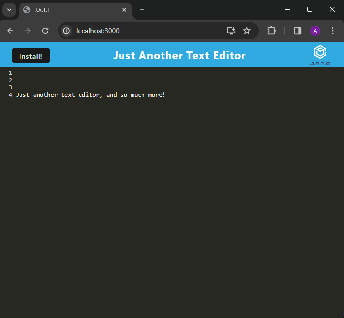

# Text Editor PWA

## Description

A Progressive Web App text editor taht can be used online or offline.

## Table of Contents (Optional)

- [Installation](#installation)
- [Usage](#usage)
- [How to contribute](#how-to-contribute)
- [Tests](#tests)
- [Questions](#questions)
- [License](#license)

## Installation

Clone the repository. Open the root directory in the termainal and run the commands `npm install` and `npm start`.

## Usage

If you are running the app locally, you should be able to access it via localhost port 3000. Whether you are accessing it locally or online, you have to option of installing the app locally via the "install" button at the top-left of the browser screen.

## Screenshot

## How to Contribute

No contributions are being considered at this time.

## Tests

No tests are available at this time.

## Questions

email: 
Github: [ag-bootcamp-umn](https://github.com/ag-bootcamp-umn)

## Credits

The base design was provided by EdX. Modification by myself, ag-bootcamp-umn. Special thanks to Gary Almes, our instructor for his walkthrough of the project and TA Katy Vincent for her explanation of PWAs.

## License

Licensed under the [MIT](https://opensource.org/license/mit/) license.
